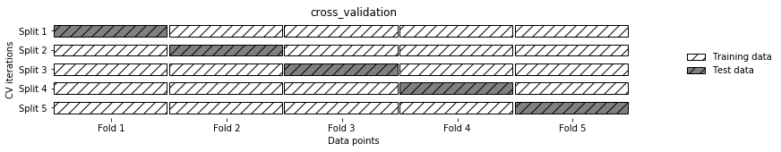

# Enron Submission Free-Response Questions

## Question 1

The goal of this project is to use machine-learning algorithms to identify persons of interest in the enron fraud case. Machine learning is useful for this task because there are certain qualities(features) of the enron employees that make them more likely to be a person of interest, and these qualities can be documented in a dataset. Machine-learning algorithms are good at using these features to predict outcomes.

**About the Data**

Here are some important characteristics about the dataset:

* There are 146 different people recorded in the dataset, each with 21 characteristics observed.


* There are 18 persons-of-interest and 128 non persons-of-interest?


* The algorithm will utilize 20 features against a binary classification: is the person a person of interest.


* There are 1358 total missing values in the dataset, and the features that have missing data include: 'bonus', 'loan_advances', 'to_messages', 'email_address', 'restricted_stock', 'restricted_stock_deferred', 'total_stock_value', 'deferred_income', 'from_messages', 'director_fees', 'other', 'long_term_incentive', 'expenses', 'total_payments', 'shared_receipt_with_poi', 'salary', 'deferral_payments', 'exercised_stock_options', 'from_this_person_to_poi', 'from_poi_to_this_person'.


**Outliers**

There are certainly some outliers in the dataset, especially relating to the 'salary' and 'bonus' categories. The biggest outlier in the enron data set was 'SKILLING JEFFREY K', and this person was removied from the dataset.

```python
data_dict.pop('SKILLING JEFFREY K', 0)
```

There are probably about four other people who would be considered outliers, but they are not removed because being an outlier could actually be an important determinant in the machine learning algorithm. Mr. Jeffrey K. Skilling was removed because his data is likely a spreadsheet quirk. There was also a key in the dictionary named 'TOTAL', and that was removed because I wasn't sure if it was a person or not.


## Question 2

 
   My feature selection method was quite simple. I started with all the features available, then narrowed it down using selectKBest. I did this by using selectKBest's pvalues method, and used numpy to convert those pvaules into scores. I consistently eliminated the the feature with the lowest score while constantly checking performance. The final features chosen appear to result in the best performance with the final model chosen. I think there has been some confusion with the previous graders so I want to make my selection method very clear. I did not use SelectKBest to automatically perform feature selection, but rather used selectKBest's .pvalues method, and ranking each feature, then **manually** removing the lowest feature shown by the pvalues:


```python
selector = SelectKBest(f_classif, k=5)
selector.fit(predictors, labels_train)
scores = -np.log10(selector.pvalues_)
print(scores)
```

The final features chosen are: 'shared_receipt_with_poi','salary', 'total_payments', 'loan_advances', 'bonus', 'deferred_income', 'total_stock_value', 'exercised_stock_options', 'salary_and_bonus'(the feature I created). Here is a list of all the features that I started with and they're pvalues:

| **features**  | **Pvalues**          
| ------------- |:-------------:| 
| Salary      | 2.59245837 | 
| deferral_payments      | 0.00645635      |   
| total_payments | 2.38104623      |
| loan_advances | 2.19557174      | 
| bonus | 5.11932372     | 
| restricted_stock_deferred| 0.37941633      | 
| deferred_income | 2.72149828      | 
| total_stock_value | 1.83583946      | 
| expenses | 1.51631991      |
| exercised_stock_options| 1.61758359      | 
| other | 1.25159684      | 
| long_term_incentive | 1.61723309      | 
| restricted_stock | 1.60048615      | 
| director_fees | 0.64916205      | 
| to_messages | 0.74907661      | 
| from_poi_to_this_person | 1.42428559      |
| from_messages | 0.27776098      | 
| from_this_person_to_poi | 0.11115044      | 
| shared_receipt_with_poi | 2.37860314      | 
| salary_and_bonus | 5.06076737      |

I started by removing all the features who's pvalues where lower than one. I then checked the accuracy, precision, and recall of my model. The model seemed to perform better but still did not meet the 0.3 requirement. So I continued to eliminate features who's pvalues were below 1.6. I was left with 'shared_receipt_with_poi': 2.37860314,'salary': 2.59245837, 'total_payments': 2.38104623, 'loan_advances': 2.19557174 , 'bonus': 5.11932372, 'deferred_income': 2.72149828, 'total_stock_value': 1.83583946, 'exercised_stock_options': 1.61758359, 'salary_and_bonus': 5.06076737. While testing my model with these features, I reached the 0.3 precision and recall requirement, so I stopped removing features here. 
  
**Did you have to do any scaling? Why or why not?**

Two different scaling methods were tested in the pipeline for the support vector machine classifier. Here is a snapshot of the parameter grid:

```python
param_grid = [
    {'classifier': [SVC()], 'preprocessing': [StandardScaler(), None, MinMaxScaler()],
    'classifier__gamma':[0.001,0.01,0.1,1,10,100],
    'classifier__C':[0.001,0.01,0.1,1,10,100]},
```
The scaler that gave the best results was the StandardScaler. However, the DecisionTreeClassifer with no scaling/preprocessing appears to give better results than a support vector machine with standard scaling.

**Feature creation**

I created one new feature, which is the sum of an enron employees' salary and bonus. I created this feature because I thought it would be a good metric for measuring an employees value to enron. Perhaps employees who are more valued by the company are more likely to be persons of interest.

## Question 3

For the predictive algorithm, I made use of a pipeline through the Pipeline method from the pipeline module in the sklearn library. Here GridSearchCV from the model_selection module really came in handy, because it allows you to test multiple models in your parameter grid. The classifier that performs the best in the pipeline is the Random Forest Classifer. The other models that were tested SVM and Decision Tree Classifier. Out of those three models, the Random Forest appears to perform the best. Once the best model was determined through the pipeline, the parameter grid from the pipeline was commented out. However, the Random Forest Classifier only preforms best according to sklearn's classification report method, but fails to meet the 0.3 precision and recall parameters according to tester.py. Thus, the final model chosen was a decision tree with default parameters. It is quite embarassing that I created a fancy pipeline and grid search only to discover that if I had used tester.py to look at precision and recall instead of sklearn's classification report I would have been finished with the project a long time ago! 

## Question 4

Each algorithm provided in the sklearn library has different parameters you can modify to alter the preformance of the model, or 'tune'. For a decision tree, it might be the maximum depth of the tree. For a support vector machine, it might be the penalty parameter of the error term(how far each observation is from the line created by the svm regression). Thus, 'tuning' in the context of machine learning can be defined as setting these parameters to optimal values that enable your model to perform and complete a learning task in the best way possible. The parameters whos values are set before the training of the model takes place is are also known as hyperparameters. The goal of any machine learning task is to set these hyperparameters to optimal values that enable the model to make the most correct predictions possible. Tuning your model is important because the default 'hyperparameters' for any model may not always produce the highest quality results.

**How did you tune the parameters of your particular algorithm?**

Luckily, GridSearchCV provides a way to do parameter tuning for you. It automatically selects the best parameters and uses those parameters in the final algorithm. I used parameter tuning on every model that I tested, in an attempt to maximize that models performance. Specifically, for the support vector machine, I used gridsearchCV to tune the gamma and the C parameters, like so:

```python
{'classifier': [SVC()], 'preprocessing': [StandardScaler(), None, MinMaxScaler()],
    'classifier__gamma':[0.001,0.01,0.1,1,10,100],
    'classifier__C':[0.001,0.01,0.1,1,10,100]}
```
Additionally, for the random forest classifier, gridsearchCV was used to tune the criterion, min_samples_split, min_samples_leaf, and max_depth parameters like so:

```python
{'classifier': [RandomForestClassifier(n_estimators=5)],
    'preprocessing':[None], 'classifier__max_features': [1,2,3],
    'classifier__criterion': ('gini', 'entropy'),
    'classifier__min_samples_split': [2,4,6],
    'classifier__min_samples_leaf': [1,2,3],
    'classifier__max_depth': [None,1, 2,4]}
```

Lastly, gridsearchCV was also used to tune the Decision Tree classifier. The paramters that were tune are the criterion, splitter, max_depth, min_samples_split, min_samples_leaf, and max_features parameters, like so:

```python
{'classifier': [DecisionTreeClassifier()], 'preprocessing':[None],
    'classifier__criterion': ('gini', 'entropy'),
    'classifier__splitter': ('best', 'random'),
    'classifier__max_depth': [None,1,2,4],
    'classifier__min_samples_split': [2,4,6],
    'classifier__min_samples_leaf': [1,2,3],
    'classifier__max_features': [1,2,3] }
```

I think there was some confusion with my previous grader. The param_grid parameter in GridSearchCV will accept a list on dictionaries, which combined with a pipeline will allow gridsearchCV to choose from multiple machine learning models in addition to their parameters. However, It made no difference in the end. As I mentioned earlier, a decision tree with the default parameters ended up with the best performance according to tester.py. The gridsearchcv gave good results in precision and recall with the classification report, but recall was consisently too low to meet the 0.3 parameters for this project. Out of frustration, I tested each model with their respective default parameters just to get a baseline, and it turned out that the decision tree classifier consistently met the 0.3 precision and recall parameters. I'm sorry if this information is confusing, but I wanted to leave the pipeline commented out in my code so that it shows I did attempt some parameter tuning, even though in the end the pipeline and grid search are not part of my final solution.

## Question 5

Validation involes splitting the data into a training and testing group, in order to asses the performance of a model. More specifically, the training data is used to train the model, and then the model's performance is evaluated with the testing portion of the dataset. There are several methods of doing this, and it is often the case that a simple random split (using the train_test_split method) is not thourough enough, and could end produce overly optimistic (or wrong) results. Consider an example where a dataset is ordered by a certain value (maybe time). In the Udacity example in which we identified whether an email was from bob or sarah, all of bob's data was on one side and all of sarah's data was on the other. This will give the model biased training data. In this case, a k-fold (k being the number of folds) cross-validation method is better. If k=5, the data is split into five folds, and one of the folds is used as a test set while the other 4 folds are used as the training set. This diagram from "Introduction to Machine Learning with Python" provides a great visualization of this concept:


```python
%matplotlib inline
import mglearn
import matplotlib.pyplot as plt

mglearn.plots.plot_cross_validation()
```





The authors of the above mentioned book are Andreas Muller and Sarah Guido, and a more detailed citation will be provided in the README file. Furthermore, the validation method used in this project was Stratified Kfold cross validation(This was done after splitting the data into training and testing groups with sklearn's train_test_split method). This was implemented through the 'cv' parameter of GridSearchCV. In the sklearn.model_selection.GridSearchCV documentation, it says under the cv parameter, "For integer/None inputs, if the estimator is a classifier and y is either binary or multiclass, StratifiedKFold is used. In all other cases, KFold is used." Please see this link: http://scikit-learn.org/stable/modules/generated/sklearn.model_selection.GridSearchCV.html. It is especially important to use stratified shuffle split for this project because the allocation of poi vs. non-poi is skewed in the dataset. In other words, there are far more observations labeled as 'poi' on one side of the data than the other, which will heavily affect the results of the model. The model plainly will not be trained well enough on if the data was simply split half way without shuffling.

## Question 6

There are evaluation methods other than accuracy, and they are often important to look at when dealing with imbalanced datasets. Specifically, it is important to look at other evaluation metrics besides accuracy in the enron dataset because most of the enron employees were not a person of interest. Therefore, you could have a model that only predicts non-poi and still end up with a high accuracy rating. This may cause your model to appear good but in reality it is a very poor model. Precision (TP/TP+FP) is usually used when you want to be aware of the number of false positives. On the flipside, recall (TP/TP+FN) is important when you want to avoid false negetives. It is very debatable which is more important for the this project, but I think in this case recall is more important. In the context of this dataset, the positive class is when a person is a poi and the negative class is when a person is not a poi. Precision is the amount of  positive poi guesses that are true over the total amount of positive guesses. Recall is the number of positive poi guesses that are true over the number of negative poi guesses that are false(guessed negative but actually positive) plus the number of positive guesses that are true. Contrast these metrics with accuracy, which in the context of this project is the number of positive poi guesses that are true plus the number of negative (non-poi) guesses that are true over the total number of guesses.


```python

```
